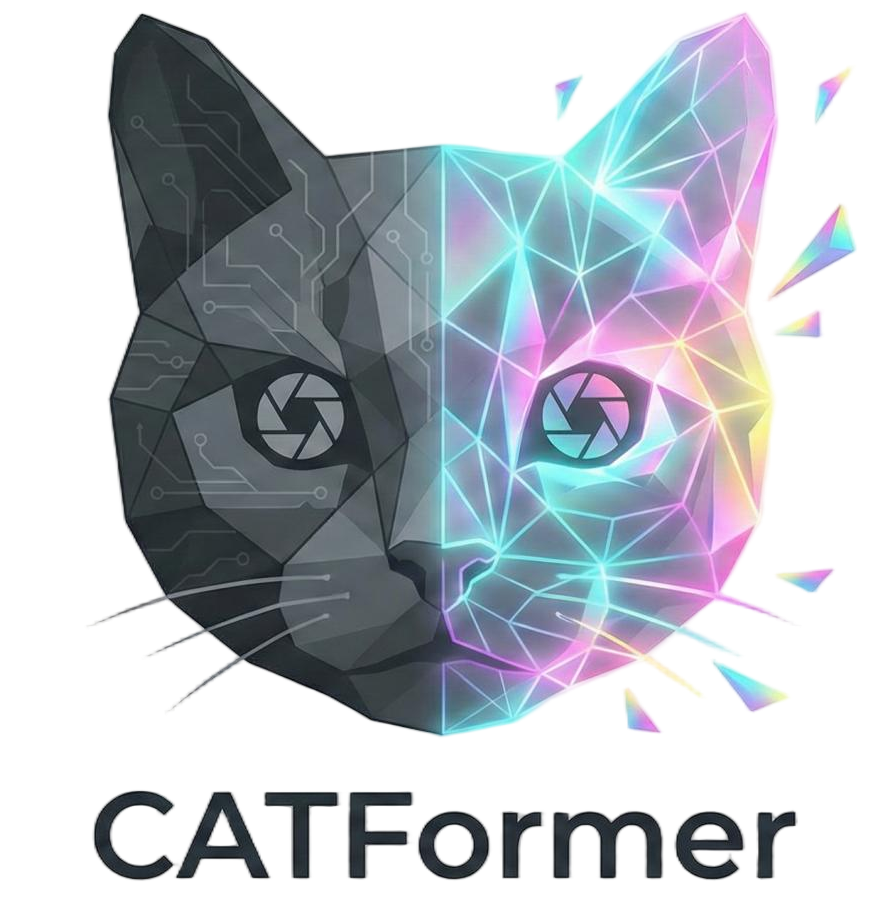

<p align="center">  </p>

<div align="center">
<h3>Device-Independent Low-Light Image Enhancement via Learnable Von Kries Chromatic Adaptation Transform</h3>

[Kunyang Wu](https://scholar.google.com/citations?hl=en&user=W2pNdNEAAAAJ)<sup>1,3</sup>, [Jun Lin](https://ciee.jlu.edu.cn/info/1162/8474.htm)<sup>1,2,3</sup>, [Zhengpeng Li](https://ieeexplore.ieee.org/author/37086228429)<sup>4</sup>, [Jiawei Miao](https://ieeexplore.ieee.org/author/268567427197560)<sup>4</sup>, [Genyuan Xing](https://scholar.google.com/citations?user=O-ld4UUAAAAJ&hl=en)<sup>1</sup>, [Jinxin Luo](https://ieeexplore.ieee.org/author/37089468294)<sup>1</sup>, [Huanyu Zhao](https://ciee.jlu.edu.cn/info/1156/14433.htm)<sup>1</sup>, [Yang Liu](https://scholar.google.com/citations?user=rN6ryXIAAAAJ)<sup>1,3*</sup>, [Guanyu Zhang](https://scholar.google.com/citations?user=mJb59RcAAAAJ&hl=en)<sup>1,3*</sup>

<sup>1</sup> Jilin University, <sup>2</sup> National Key Laboratory of Deep Exploration and Imaging, <sup>3</sup> Institute of Intelligent Instruments and Measurement Controlling Technology, <sup>4</sup> University of Science and Technology Liaoning

<sup>*</sup> Corresponding authors: liu_yang@jlu.edu.cn, zhangguanyu@jlu.edu.cn

</div>

## ✅ Main Results

### **1. Quantitative Comparison on LOL Benchmarks (Table I)**

| Method | Venue | LOLv1<br>PSNR / SSIM / LPIPS | LOLv2-Real<br>PSNR / SSIM / LPIPS | LOLv2-Syn<br>PSNR / SSIM / LPIPS |
| :--- | :---: | :---: | :---: | :---: |
| RetinexNet | BMVC 18 | 16.77 / 0.463 / 0.474 | 16.09 / 0.401 / 0.543 | 17.13 / 0.762 / 0.255 |
| KinD | MM 19 | 20.86 / 0.799 / 0.207 | 17.54 / 0.669 / 0.375 | 18.32 / 0.796 / 0.252 |
| Zero-DCE | CVPR 20 | 16.79 / 0.557 / 0.405 | 16.05 / 0.580 / 0.313 | 17.71 / 0.815 / 0.169 |
| EnlightenGAN | TIP 21 | 17.48 / 0.652 / 0.319 | 18.64 / 0.677 / 0.306 | 16.57 / 0.772 / 0.221 |
| Restormer | CVPR 22 | 22.15 / 0.817 / 0.151 | 21.23 / 0.820 / 0.191 | 25.10 / 0.925 / 0.066 |
| LLFormer | AAAI 23 | 23.64 / 0.819 / 0.169 | 21.50 / 0.799 / 0.267 | 24.45 / 0.913 / 0.069 |
| NeRCo | IJCV 23 | 22.94 / 0.786 / 0.146 | 18.49 / 0.633 / 0.414 | 19.51 / 0.763 / 0.231 |
| CUE | ICCV 23 | 21.66 / 0.774 / 0.224 | 22.55 / 0.803 / 0.210 | 22.09 / 0.878 / 0.112 |
| RetinexFormer | ICCV 23 | 23.38 / 0.833 / 0.140 | 22.79 / 0.840 / 0.171 | 25.48 / 0.928 / 0.059 |
| QuadPrior | CVPR 24 | 22.84 / 0.800 / 0.202 | 20.59 / 0.811 / 0.202 | 16.10 / 0.758 / 0.114 |
| GSAD | NeurIPS 24 | 22.40 / 0.851 / *0.104* | 20.19 / 0.845 / 0.113 | 24.21 / 0.927 / 0.053 |
| IGDFormer | PR 25 | 24.11 / 0.821 / 0.113 | 22.73 / 0.833 / 0.119 | 25.33 / 0.937 / 0.057 |
| HVI-CIDNet | CVPR 25 | 23.50 / *0.870* / 0.105 | *24.11* / *0.871* / *0.108* | *25.70* / *0.942* / 0.045 |
| Diff-Retinex++ | TPAMI 25 | *24.66* / *0.867* / 0.101 | 23.41 / *0.872* / 0.134 | 26.05 / *0.944* / *0.041* |
| **CATFormer** | **Ours** | **24.87** / **0.870** / **0.061** | **24.92** / **0.882** / **0.097** | **26.32** / **0.946** / **0.040** |

*   *Red indicates best performance, Blue indicates second-best. CATFormer achieves SOTA across all LOL benchmarks.*

### **2. Generalization to Different Devices (Table II)**

| Method | Venue | LSRW-Huawei<br>PSNR / SSIM | LSRW-Nikon<br>PSNR / SSIM | Params (M) ↓ | FLOPs (G) ↓ |
| :--- | :---: | :---: | :---: | :---: | :---: |
| RetinexNet | BMVC 18 | 16.16 / 0.483 | 13.23 / 0.348 | 0.84 | 584.47 |
| Zero-DCE | CVPR 20 | 15.80 / 0.500 | 14.87 / 0.436 | **0.08** | **4.83** |
| Restormer | CVPR 22 | 19.09 / 0.598 | *17.59* / 0.488 | 26.13 | 144.25 |
| RetinexFormer | ICCV 23 | *21.27* / *0.633* | 17.72 / *0.518* | *1.53* | 15.85 |
| HVI-CIDNet | CVPR 25 | 20.72 / 0.615 | 17.33 / 0.506 | 1.88 | 7.57 |
| Diff-Retinex++ | TPAMI 25 | 20.56 / 0.613 | 17.38 / 0.505 | 62.80 | 617.32 |
| **CATFormer** | **Ours** | **21.34** / **0.641** | **17.79** / **0.532** | 4.80 | **4.35** |

*   *CATFormer demonstrates superior generalization on real-world datasets captured with different sensors (Huawei/Nikon) while maintaining extremely low computational cost.*

### **3. Extreme Low-Light & No-Reference Evaluation (Table III)**

| Method | Venue | LLRW-Xiaomi (MUSIQ ↑) | LLRW-Vivo (MUSIQ ↑) |
| :--- | :---: | :---: | :---: |
| RetinexNet | BMVC 18 | 45.109 | 41.332 |
| KinD | MM 19 | 53.121 | 45.880 |
| Zero-DCE | CVPR 20 | 42.515 | 40.123 |
| Restormer | CVPR 22 | 44.522 | 44.050 |
| RetinexFormer | ICCV 23 | 48.906 | 47.065 |
| GSAD | NeurIPS 24 | *67.950* | 51.262 |
| IGDFormer | PR 25 | 65.952 | 51.109 |
| Diff-Retinex++ | TPAMI 25 | 63.724 | *54.642* |
| **CATFormer** | **Ours** | **67.984** | **55.037** |
| **CATFormer†** | **Ours** | **73.202** | **57.890** |

*   *CATFormer† is a variant trained with extensive data augmentations. The results confirm our method's robustness in extreme dark conditions where other methods fail.*

### **4. Downstream Object Detection Task (ExDark Dataset - Table VIII)**

| Method | Venue | Precision | Recall | mAP@0.50 ↑ | mAP@0.50-0.95 ↑ |
| :--- | :---: | :---: | :---: | :---: | :---: |
| RetinexNet | BMVC 18 | 0.611 | 0.683 | 0.652 | 0.414 |
| Zero-DCE | CVPR 20 | 0.615 | 0.693 | 0.621 | 0.410 |
| EnlightenGAN | TIP 21 | 0.618 | 0.696 | 0.648 | 0.416 |
| Restormer | CVPR 22 | 0.621 | 0.693 | 0.646 | 0.419 |
| RetinexFormer | ICCV 23 | *0.637* | 0.692 | 0.692 | 0.417 |
| HVI-CIDNet | CVPR 25 | *0.638* | **0.700** | *0.700* | *0.425* |
| Diff-Retinex++ | TPAMI 25 | 0.634 | *0.699* | 0.699 | 0.423 |
| **CATFormer** | **Ours** | **0.642** | **0.706** | **0.706** | **0.430** |

*   *CATFormer significantly improves object detectability in low-light scenes, achieving the highest mAP, validating that our restoration preserves semantic features effectively.*

## ⚙️ Installation

### Step 1: Clone the CATFormer repository:

To get started, first clone the CATFormer repository and navigate to the project directory:

```bash
git clone https://github.com/wuky2000/CATFormer.git
cd CATFormer
```

### Step 2: Environment Setup:

CATFormer recommends setting up a conda environment and installing dependencies via pip. Use the following commands to set up your environment:

**Create and activate a new conda environment**

```bash
conda create -n catformer python=3.10
conda activate catformer
```

**Install Dependencies**

```bash
pip install -r requirements.txt
```

## 💾 Datasets

You can refer to the following links to download the datasets.

- LOLv1: [Baidu Pan](https://pan.baidu.com/s/1MclLfC7HP0XpM80z4JG5dw?pwd=wuky) (code: `wuky`)
- LOLv2: [Baidu Pan](https://pan.baidu.com/s/17WttsgcBdJLYqHnMRr91Fg?pwd=wuky) (code: `wuky`)
- LSRW: [Baidu Pan](https://pan.baidu.com/s/1ucMICkg2ro09ccu-uvUykw?pwd=wuky) (code: `wuky`)
- LLRW: [Baidu Pan](https://pan.baidu.com/s/10mhtnGW6qTZ9H0otVGFbjg?pwd=wuky)(code: `wuky`)
- ExDark: [Baidu Pan](https://pan.baidu.com/s/1sxwnBREFPxpWTMFYU10VCg?pwd=wuky)(code: `wuky`)


## ⏳ Model Training

We put all the configurations that need to be adjusted in the `./data/options.py` folder and explained them in the file. We apologize that some of the training parameters we are no longer able to provide and share with you, but we guarantee that all the weights are trainable by parameter tuning. You can train our CATFormer by:

```bash
python train.py
```

All weights are saved to the `./weights/train` folder and are saved in steps of the checkpoint set in the `options.py`  as `epoch_*.pth` where `*` represent the epoch number.

Also, for every weight saved, metrics are measured for the validation set and printed to the command line. Finally, the results of all weights' test metrics on the validation set and options in `./data/options.py` will be saved to `./results/training/metrics-YYYY-mm-dd-HHMMSS.md`.

In each epoch, we save an output (test) and GT image to the `./results/training` folder to facilitate the visualization of the training results and progress of each epoch, as well as to detect the generation of gradient explosion in advance.

After each checkpoint, we save all the validation set outputs for this time in the `./results` folder to the corresponding folder. Note that we use a replacement strategy for different checkpoints for each dataset. That is, we do not save the plots of all checkpoints, but only the weights of each checkpoint.


## 📊 Testing

```bash
python eval.py --datasets --options

python measure.py --datasets
```


To evaluate the Parameters, FLOPs, and running time of CATFormer:

```bash
python net_test.py
```

Images for submission can be download in [Baidu Pan](https://pan.baidu.com/s/1MclLfC7HP0XpM80z4JG5dw?pwd=wuky) (code: `wuky`)


## 👩‍⚖️ Acknowledgement

Thanks the authors for their works: [Retinexformer](https://github.com/caiyuanhao1998/Retinexformer), [HVI-CIDNet](https://github.com/Fediory/HVI-CIDNet).

Besides, we also thank [Diff-Retinex++](https://github.com/XunpengYi/Diff-Retinex-Plus) for providing their LLRW-Xiaomi datasets.